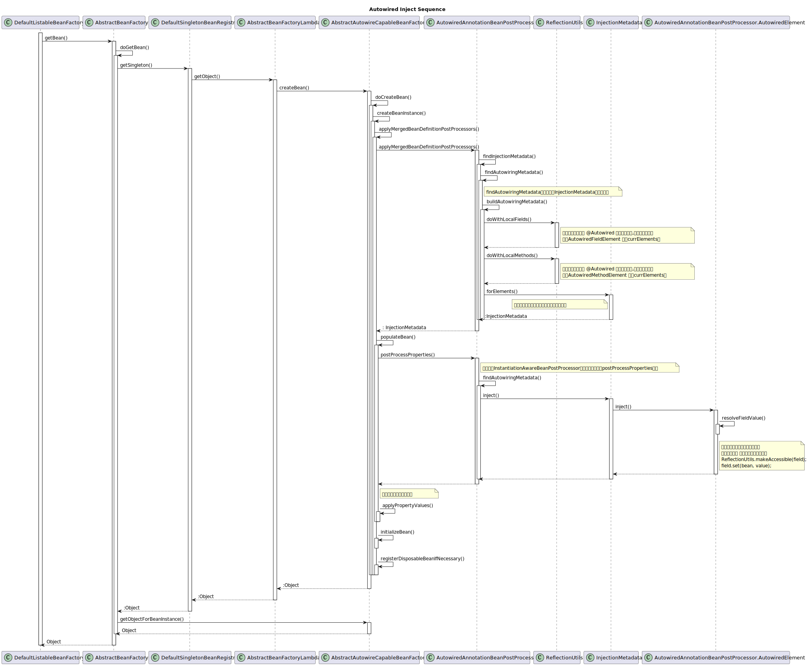

## **使用@Autowired @Inject注入**
官方文档: [@Autowired使用](https://docs.spring.io/spring-framework/reference/core/beans/annotation-config/autowired.html)
[@Autowired源码](https://github.com/spring-projects/spring-framework/blob/main/spring-beans/src/main/java/org/springframework/beans/factory/annotation/Autowired.java)
### **@Autowired注入的规则以及原理**
@Autowired  @Inject(JSR-330) @Value等注解由这个类去筛选[AutowiredAnnotationBeanPostProcessor](https://github.com/spring-projects/spring-framework/blob/main/spring-beans/src/main/java/org/springframework/beans/factory/annotation/AutowiredAnnotationBeanPostProcessor.java)   下图是AutowiredAnnotation相关类图

#### **@autowired 注入过程**
注入过程可以分为一下几步
1. 元信息解析
2. 依赖查找
3. 依赖注入(字段,方法)

