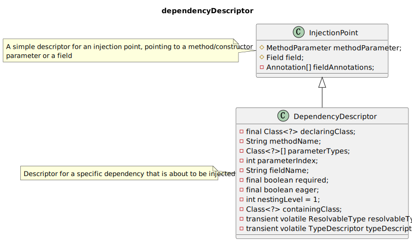

# **依赖解决**
在依赖注入的时候,
* 入口  AutowireCapableBeanFactory#resolveDependency 
        DefaultListableBeanFactory#resolveDependency
* 依赖描述符 - DependencyDescriptor
* 自定绑定候选对象处理器 - AutowireCandidateResolve
## **resolveDependency**

接口 [AutowireCapableBeanFactory](https://github.com/spring-projects/spring-framework/blob/main/spring-beans/src/main/java/org/springframework/beans/factory/config/AutowireCapableBeanFactory.java) 提供了两个方法来处理注入Bean的依赖关系.
```java
    Object resolveDependency(DependencyDescriptor descriptor, @Nullable String requestingBeanName) throws BeansException;
    Object resolveDependency(DependencyDescriptor descriptor, @Nullable String requestingBeanName,
			@Nullable Set<String> autowiredBeanNames, @Nullable TypeConverter typeConverter) throws BeansException;
```
## **DependencyDescriptor**
[DependencyDescriptor](https://github.com/spring-projects/spring-framework/blob/main/spring-beans/src/main/java/org/springframework/beans/factory/config/DependencyDescriptor.java) 会对指定的注入的依赖进行描述, 包装构造器参数,方法参数或者一个字段,允许对元数据进行统一访问.
  

**InjectionPoint**
是一个注入点, 指向一个方法/构造参数 或者一个字段.
```java
    //存放包装方法函数
	protected MethodParameter methodParameter;
    //存放包装成员属性
	protected Field field;

	private volatile Annotation[] fieldAnnotations;
```
**DependencyDescriptor** 
```java
    //当前属性或者方法所在的类的信息
    private final Class<?> declaringClass;
	//如果当前以来某个方法参数,记录方法名称.
	private String methodName;
    //如果所包装的成员方法的某个参数,记录该参数类型
	private Class<?>[] parameterTypes;
    //如果所包装的成员方法的某个参数,记录该参数在方法列表中的索引
	private int parameterIndex;
    //如果当前以来某个字段,记录字段名称.
	private String fieldName;
    //表示所包装依赖是否必须依赖.
	private final boolean required;
    // 标识所包装依赖是否需要饥饿加载
	private final boolean eager;
    // 标识所包装依赖的嵌套级别
	private int nestingLevel = 1;
    // 标识所包装依赖的包含者类，通常和声明类是同一个
	private Class<?> containingClass;
    // 所包装依赖  解析后的 字段方法 ResolvableType 的类型
	private transient volatile ResolvableType resolvableType;
    // 要转换的方法类型
	private transient volatile TypeDescriptor typeDescriptor;
```
