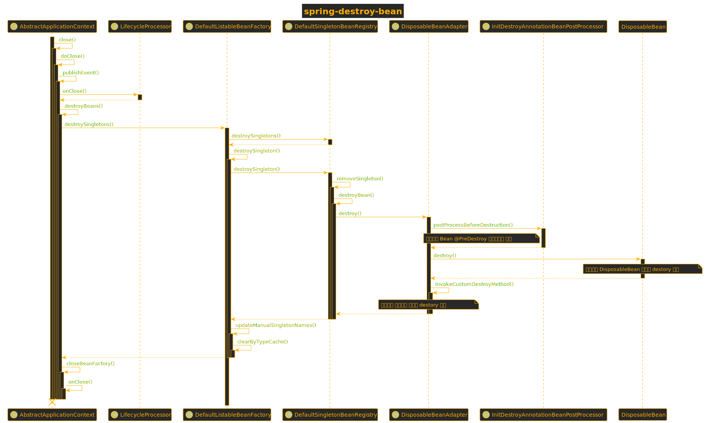

# **Spring Beans Destory**
## **Spring bean的销毁**  
 Bean 销毁（Destroy）
* @PreDestroy 标注方法
* 实现 DisposableBean 接口的 destroy() 方法
* 自定义销毁方法
  * XML 配置：<bean destroy=”destroy” ... />
  * Java 注解：@Bean(destroy=”destroy”)
  * Java API：AbstractBeanDefinition#setDestroyMethodName(String)  

调用顺序为  @PreDestroy->DisposableBean->destroyMethod

### **ApplicationContext** 销毁流程
