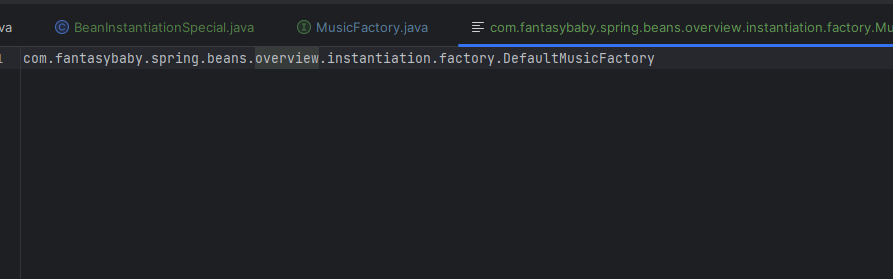

# **Spring Beans Instantiation**
Bean的实例化是在依赖注入的时候触发的
## **Spring bean的实例化方式**  
1. 常规方式
   [相关代码](../../spring-beans-overview/src/main/java/com/fantasybaby/spring/beans/overview/instantiation/BeanInstantiationNormal.java)
    * 通过构造器（配置元信息：XML、Java 注解和 Java API ）
    * 通过静态工厂方法（配置元信息：XML 和 Java API ）
        ```xml
        <bean id="bean-static-method" class="com.fantasybaby.spring.beans.overview.instantiation.Music" factory-method="createMusic"/>
        ```
    * 通过 Bean 工厂方法（配置元信息：XML和 Java API ）
        ```xml
        <!--通过实例方法 抽象工厂创建 -->
        <bean id="bean-instance-method" class="com.fantasybaby.spring.beans.overview.instantiation.Music" factory-bean="defaultMusicFactory" factory-method="createMusic" />
        <bean id="defaultMusicFactory" class="com.fantasybaby.spring.beans.overview.instantiation.factory.DefaultMusicFactory"/>
        ```
    * 通过 FactoryBean（配置元信息：XML、Java 注解和 Java API ）
        1. 实现[FactoryBean](https://github.com/spring-projects/spring-framework/blob/main/spring-beans/src/main/java/org/springframework/beans/factory/FactoryBean.java) 类
        2. 直接配置实例
        ```java
            public class MusicFactoryBean implements FactoryBean<Music> {
                @Override
                public Music getObject() {
                    ...
                    return music;
                }
            }

        ```
        ```xml
        <bean id="bean-factory-bean" class="com.fantasybaby.spring.beans.overview.instantiation.factory.MusicFactoryBean"  />
        ```
2. 特殊方式
    *  通过 ServiceLoaderFactoryBean（配置元信息：XML、Java 注解和 Java API ）  
        [ServiceLoaderFactoryBean](https://github.com/spring-projects/spring-framework/blob/main/spring-beans/src/main/java/org/springframework/beans/factory/serviceloader/ServiceLoaderFactoryBean.java)是用来适配ServiceLoader
        [ServiceLoader](https://github.com/openjdk/jdk/blob/master/src/java.base/share/classes/java/util/ServiceLoader.java)是Java的一个传统的加载类.  
        1. 创建在该目录下创建文件文件
            ``` java
                    private static final String PREFIX = "META-INF/services/";
            ```
           
        2.  用服务的实现为内容,可以为一个或者多个  
           
    *  通过 AutowireCapableBeanFactory#createBean(java.lang.Class, int, boolean)  
        ```java
                AutowireCapableBeanFactory autowireCapableBeanFactory = beanFactory.getAutowireCapableBeanFactory();
                MusicFactory musicFactory = autowireCapableBeanFactory.createBean(DefaultMusicFactory.class);
        ```
    *  通过 BeanDefinitionRegistry#registerBeanDefinition(String,BeanDefinition)
        ```java  
                AnnotationConfigApplicationContext registry;
                registry.registerBeanDefinition(beanName, userBeanDefinition);
        ```


       